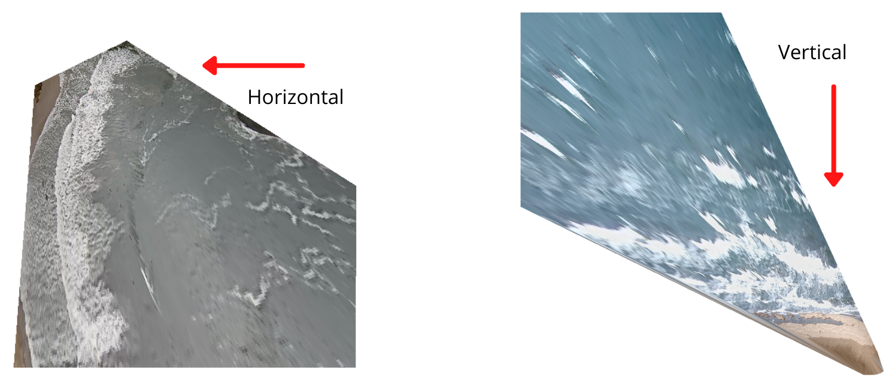

# Sand Bar Detection

This repository allows to identify sand bar using wave breaking patterns. To obtain wave breaking patterns is used a method propuse in [Wave-by-wave Nearshore Wave Breaking Identificationusing U-Net](https://github.com/fj23eslaonda/Wave_by_Wave_Identification) by Sáez et al. (2021). Main idea is to identify waves breaking frame by frame on a beach of interest and calculate the cumulative sum over all mask or patterns to create a cumulative breaking pixels map. Finally, algorithm detects all the maximum points on cumulative map to estimate the position of sand bar position.

## Inputs and parameters
**Parameters**
- `main_path`: Main folder where the repository is cloned    
- `image_path`: Path of frames folder 
- `output_path`: Path of mask folder 
- `beach_path`: Path of beach folder to save results (inside of main_path)
- `plot_mask`: Boolean variable to save plots or not
- `plot_mask_over_img`: Boolean variable to save plots or not
- `orientation`: Waves direction 

**Inputs**

It's necessary to have rectified images of your beach of interest and it's very important than wave direction is from top to bottom (`orientation`: vertical) or from right to left of images (`orientation`: horizontal). That's because the method propuse by Sáez et al. (2021) was trained with a specific direction (horizontal) then if you have vertical direction the algorithm will turn the images.

<p align="center">
  
</p>
<p align="center">
    <em>Figure 1: Examples of wave directions.</em>
</p>

**Folders**
```
Main_folder
    ├─── beach_path
         ├─── frames
              ├─── P_00000.png
              ├─── ...
              ├─── P_N.png
         ├─── sandbar_results
    ├─── model
         ├─── best_model_final.h5
         ├─── model_final.json
    ├─── duck_model.py
    ├─── sandbar.py
    ├─── run_prediction.py
    ├─── requirements.py
```    

## Implementation
The algorithm uses tensorflow packages then it's necessary to create a new virtual environment. All packages are in `requirements.txt`. The algorithm uses python 3.7.

#### Install Python 3.7
1. `sudo add-apt-repository ppa:deadsnakes/ppa`
2. `sudo apt-get update`
3. `sudo apt-get install python3.7`

#### Create virtual environment and clone respository
1. `virtualenv -p python3.7 <my_env_name>`
2. `source <my_env_name>/bin/activate`
3. `cd ./Desktop/`
4. `git clone https://github.com/fj23eslaonda/sandbar_detection_using_wave_breaking.git`

#### Activate virtual environment, change directory and run algorithm
1. `cd ./Desktop/main_path`
2. `pip install -r requirements.txt`
3. Create **folders** with datasets
4. `python3 run_prediction.py --beach_path /beach_folder/ --image_path /frames/ --output_path /prediction_mask/ --orientation vertical/horizontal --plot_mask True --plot_mask_over_mask True`

## Comments
- `main_path` by default is the folder where the repository is cloned using `os.getcwd()`
- `plot_mask` by default is `False`
- `plot_mask_over_img` by default is `False`

